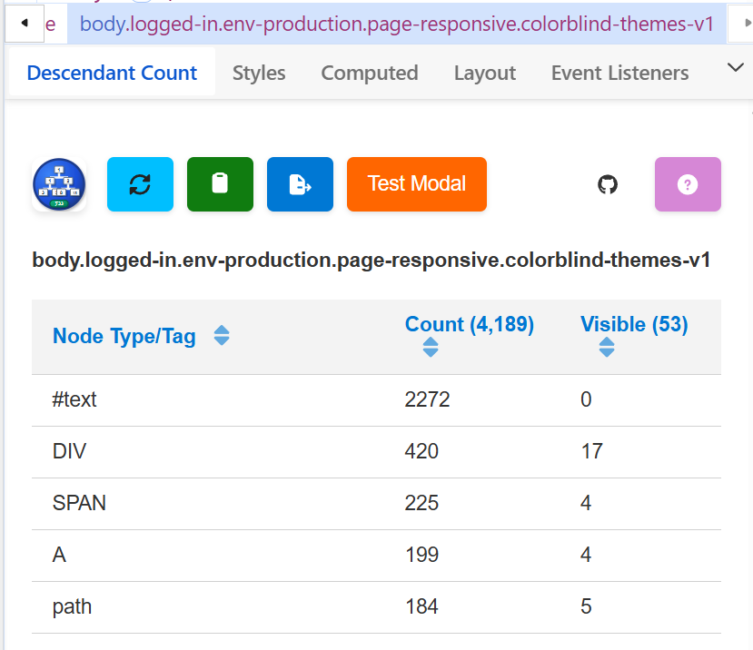
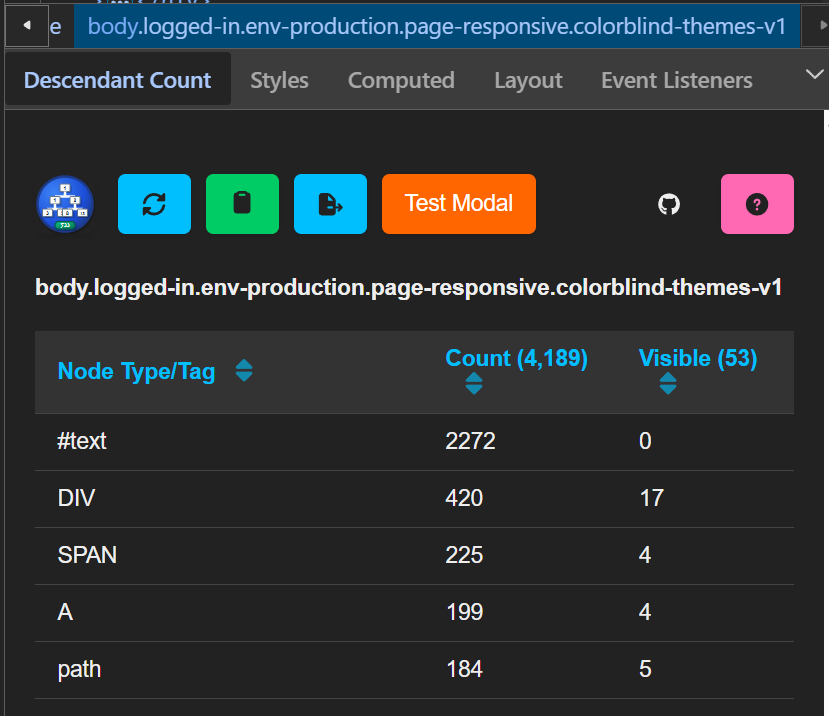

# DOM Descendant Counter 

A Chrome DevTools extension that provides detailed analysis of DOM element hierarchies by recursively counting children of selected nodes.

## Overview

DOM Descendant Counter enhances the Chrome DevTools Elements panel by adding a sidebar that displays comprehensive statistics about the descendants of any selected HTML element. Whether you're debugging complex layouts, analyzing page structure, or optimizing DOM performance, this extension provides valuable insights into your page's element hierarchy.

## Main Objective

The extension's primary goal is to **recursively count all children of the selected node** in the DevTools Elements panel. When you select any element in the DOM tree, the extension analyzes the entire subtree and provides:

- **Total descendant count** - All child elements, text nodes, and comments
- **Visible descendant count** - Only elements currently visible in the viewport  
- **Detailed breakdown by node type** - Count statistics for each HTML tag and node type

## Key Features

### 🔍 **Recursive Node Analysis**
- Counts all descendants of the selected element, not just direct children
- Distinguishes between total elements and those visible in the viewport
- Analyzes all node types including HTML elements, text nodes, and comments
- Real-time updates as you navigate through the DOM tree

### 📊 **Sortable Data Table**
- **Interactive column headers** - Click any column header to sort the data
- **Smart sorting logic**:
  - Node Type: Alphabetical sorting (A-Z / Z-A)
  - Count: Numerical sorting (highest/lowest first)
  - Visible: Numerical sorting (highest/lowest first)
- **Visual sort indicators** - Arrows show current sort column and direction
- **Accessibility support** - Proper ARIA attributes for screen readers

### 📋 **Copy Table Feature**
- **One-click copying** - Copy the data table as Markdown format to clipboard
- **Multiple fallback methods** - Ensures copying works across different browser contexts
- **Cross-origin support** - Handles clipboard access in DevTools environment
- **Fallback modal** - If automatic copying fails, displays a modal for manual copying

### 📁 **Export to Markdown**
- **Complete report generation** - Creates detailed Markdown files with full analysis
- **Structured format** includes:
  - Selected element information (tag, ID, classes)
  - Total and visible descendant counts
  - Complete data table with all node types
  - Generation timestamp and extension attribution
- **Automatic downloads** - Files saved with descriptive names including element info and timestamp

### ❓ **Help and Documentation**
- **Built-in help** - Click the help button to learn about visibility criteria
- **Clear definitions** - Explains what counts as a "visible" descendant element
- **Accessibility information** - Details about how elements are analyzed and counted

### 🎨 **Theme Support**
- **Automatic theme detection** - Matches DevTools light/dark theme preferences
- **Instant theme switching** - No reload required when changing DevTools theme
- **Consistent styling** - Maintains visual coherence with DevTools interface

## Screenshots & Samples

**Light Mode**

*The extension interface in DevTools light theme showing the sortable table with element counts*

**Dark Mode**

*The extension interface in DevTools dark theme with the same functionality and data*

**Exported Markdown Sample**

Follow [this link](docs/export-sample.md) to the sample markdown file.

## Installation

> [!IMPORTANT]
> The logos for this extension are made in SVG, but PNG is required.  The build process will assume [ImageMagick](https://imagemagick.org/) is installed and will attempt to produce the PNG's from the SVG's using it.  If you don't want to install this, eliminate the `icons` section from `src/manifest.json` before building.  If there are no icons in the manifest, the build won't attempt their creation.
> 
> Also note that building uses a PowerShell script.  PowerShell is much faster than bash.  If you're on Mac or Linux, give PowerShell a try.

1. Clone or download this repository
2. Run `npm install` to install dependencies
3. Run `npm run build` to build the extension
4. Open Chrome and navigate to `chrome://extensions/`
5. Enable "Developer mode" 
6. Click "Load unpacked" and select the `dist` folder

## Usage

1. Open Chrome DevTools (F12)
2. Navigate to the **Elements** panel
3. Select any element in the DOM tree
4. Look for the **"Descendant Count"** sidebar panel
5. View the detailed breakdown of child elements
6. Use the column headers to sort data by different criteria
7. Click **"Copy List"** (clipboard icon) to copy data to clipboard
8. Click **"Export to Markdown"** (export icon) to download a complete report
9. Click the **"Help"** button (question mark icon) to learn about visibility criteria

## Technical Details

- **Built with TypeScript** - Full type safety and modern JavaScript features
- **Vite build system** - Fast development and optimized production builds
- **Chrome Extension Manifest V3** - Latest extension architecture
- **Modular architecture** - Separated concerns for maintainability
- **Cross-context clipboard handling** - Robust clipboard operations in DevTools environment

## File Structure

```
src/
├── manifest.json          # Extension configuration
├── devtools.html/ts       # DevTools page entry point  
├── sidebar.html/ts        # Main UI panel
├── data-collector.ts      # DOM analysis logic
├── table-sort.ts          # Sortable table functionality
├── clipboard.ts           # Copy-to-clipboard operations
├── markdown.ts            # Export functionality
├── modal.ts               # Modal utility functions
├── ui.ts                  # UI rendering and management
├── background.ts          # Background script for privileged operations
├── types.ts               # TypeScript type definitions
├── vite-env.d.ts          # Vite type declarations
├── public/                # Stylesheets for theming
│   ├── style.css          # Base styles and modal styles
│   ├── style-dark.css     # Dark theme overrides
│   └── style-light.css    # Light theme overrides
└── assets/
    ├── copy-modal.html    # Copy modal template
    └── help-visible-modal.html # Help modal template
```

## Development

```bash
# Install dependencies
npm install

# Build for development
npm run build

# The built extension will be in the `dist/` folder
```

## Browser Support

- Chrome 88+ (DevTools extensions support)
- Chromium-based browsers with DevTools

## License

MIT License - see LICENSE file for details

---

*Enhance your DevTools experience with detailed DOM insights!*
